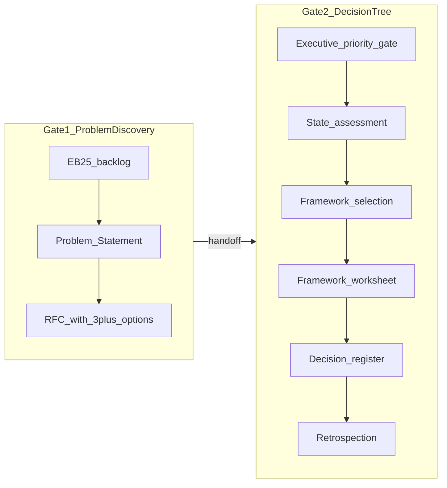

# Decision framework browser app (Streamlit + Docker)

## What you are operationalizing

The repo defines a **two-gate** executive process ([README.md](README.md)):



**Google Forms pain points this solves:** branching logic (framework tree), multi-step/async work (RFC then decision days later), structured scoring (risk 1–4 × 5, ICE), enforced rules (≥3 options, EB-25 cap of 25), and **auditable exports**—without free-tier response/branching limits.

Your [operating model](README.md) already says live work stays **outside** this repo; the app should be the “team workspace” replacement, not a place to commit filled templates into `decision-framework/`.

---

## Recommended stack: Streamlit + Docker (local)

| Choice | Why it fits |
|--------|-------------|
| **Streamlit** | Fast multi-step wizards, numeric inputs, tables (EB-25, ICE matrix), inline help text pulled from framework docs; Python matches the decision-tree logic. |
| **SQLite on a Docker volume** | Durable working copies for a 2-person team; no external DB to run on a NAS/laptop. |
| **Markdown export (Jinja2)** | Outputs match [templates](decision-framework/) so cofounders can still drop files into Obsidian/shared drive; register rows export for board packs. |
| **Simple password auth** | `streamlit-authenticator` or env-based shared secret; sufficient for “Docker on cofounder machine / home NAS, not on public internet.” |

**Alternatives (only if Streamlit feels limiting later):** FastAPI + HTMX for stronger per-user sessions; self-hosted NocoDB for the register only (weak at guided Gate 2 logic). For your stated deploy model, Streamlit is the right v1.

---

## Repository layout (new app, data isolated)

Add a sibling app package—**do not** store filled decisions under `decision-framework/`:

```
decision-app/
  app/
    main.py                 # Streamlit multipage entry + auth gate
    pages/
      01_eb25.py            # Gate 1: backlog + promote/demote
      02_problem.py         # Problem Statement form
      03_rfc.py             # RFC + ≥3 options validator
      04_handoff.py         # Handoff checklist → start decision
      05_context_card.py    # Gate 0 + state assessment
      06_framework.py       # Dynamic worksheet by framework
      07_register.py          # Decision register + stats
      08_export.py          # Bulk Markdown / ZIP download
    engine/
      framework_selector.py # Port of 04-framework-selection.md tree
      risk.py                 # Sum + LOW/MED/HIGH/CRITICAL bands
      reversibility.py        # Type I–IV helper + manual override
      ids.py                  # YYYY-MM-DD-short-slug convention
    models/                   # Pydantic/SQLModel schemas
    storage/                  # SQLite CRUD
    export/                   # Jinja templates mirroring markdown masters
  Dockerfile
  docker-compose.yml          # mount ./data → /app/data
  requirements.txt
  .env.example                # AUTH_USERS, cookie secret (not committed)
data/                         # gitignored — all live records
```

Update [README.md](README.md) “Tooling roadmap (Phase 2)” to point at `decision-app/` once built; keep [`.gitignore`](.gitignore) excluding `decision-app/data/`.

---

## Core product flows (full gates, as you selected)

### Gate 1 — Problem Discovery

1. **EB-25 backlog** — Capture symptoms; Eisenhower quadrant; enforce **≤25 active** (Top 5 + Next 20) per [eb-25-backlog.md](decision-framework/01-problem-discovery/templates/eb-25-backlog.md); “Avoid” list optional.
2. **Problem Statement** — Form fields from [problem-statement.md](decision-framework/01-problem-discovery/templates/problem-statement.md) (context, friction, impact, constraints, success criteria); link repos/tech-stack refs.
3. **RFC** — Sections from [rfc.md](decision-framework/01-problem-discovery/templates/rfc.md); **block handoff** until ≥3 distinct options documented ([06-handoff-to-decision.md](decision-framework/01-problem-discovery/06-handoff-to-decision.md)).
4. **Handoff screen** — Checklist UI; status → `ready_for_decision`; link Problem ID + RFC ID(s).

### Gate 2 — Decision Tree

1. **Gate 0** — Executive sign-off required? Problem Discovery handoff complete (or expedited/emergency flag per [07-emergency-and-expedited.md](decision-framework/01-problem-discovery/07-emergency-and-expedited.md)).
2. **Decision Context Card** — Alignment (YES/NO/PARTIAL), risk matrix (5 × 1–4 + rationales), reversibility factors → **Type I–IV** ([decision-context-card.md](decision-framework/02-decision-tree/templates/decision-context-card.md)).
3. **Framework recommendation** — Implement the tree in [04-framework-selection.md](decision-framework/02-decision-tree/04-framework-selection.md) as testable Python:

```python
# Simplified logic — full version follows mermaid in 04-framework-selection.md
def recommend_framework(rev_type, risk_score, alignment, flags):
    if flags.get("values_based"):
        return "STOP", ["Alignment Resolution"]
    if rev_type == "IV":
        return "STOP", ["Weighted Matrix"]
    if rev_type == "I":
        return "5-Minute Rule", ["ICE"]
    if rev_type == "II":
        if risk_score <= 8:
            return "ICE", ["ASOFF"]
        if risk_score <= 12:
            return "ASOFF", ["Weighted Matrix"]
        return "Weighted Matrix", ["ASOFF"]
    # Type III: branch on alignment FULL / PARTIAL / NONE
    ...
```

Show **recommended + alternatives** on screen; require cofounder to **confirm or override with rationale** (audit trail).

4. **Framework worksheet** — One dynamic form per template under [02-decision-tree/templates/](decision-framework/02-decision-tree/templates/):
   - ICE: options × Impact/Confidence/Ease + auto `I×C×E`
   - ASOFF / STOP / RAPID / Weighted Matrix / 5-Minute / Alignment Resolution — field sets copied from each template’s headings
5. **Decision register** — Auto-append row; dashboard stats from [decision-register.md](decision-framework/02-decision-tree/templates/decision-register.md).
6. **Retrospection** — Prompt when mandatory (STOP, Alignment Resolution, Type III/IV per [07-retrospection.md](decision-framework/02-decision-tree/07-retrospection.md)).

### Export (critical for adoption)

On completion (or any step “Save draft”):

- Write `data/exports/{decision_id}/` as Markdown files named like `2026-05-24-sdk-platform-context-card.md`
- Optional **ZIP download** from Streamlit
- Never auto-commit exports into `command-center` git

---

## Data model (SQLite)

Minimal entities aligned to templates:

| Table | Purpose |
|-------|---------|
| `problems` | EB-25 rank, Eisenhower, owner, status |
| `problem_statements` | 1:1 with problem when promoted |
| `rfcs` | 1:n options JSON; review status |
| `decisions` | Links problem + RFC(s); gate flags |
| `context_cards` | Alignment, risk scores, reversibility, framework choice |
| `framework_records` | JSON blob per framework type |
| `register_entries` | Denormalized row for list/stats |
| `audit_log` | Who changed what (cofounder name from login) |

IDs: **`YYYY-MM-DD-short-slug`** everywhere ([README operating model](README.md)).

---

## Docker (local cofounder / NAS)

**Dockerfile** — `python:3.12-slim`, install `requirements.txt`, `EXPOSE 8501`, `CMD streamlit run app/main.py`.

**docker-compose.yml** essentials:

- Service `decision-app` on port `8501` bound to `127.0.0.1` (not `0.0.0.0` unless you intend LAN-only access)
- Volume `./data:/app/data`
- Env: `AUTH_USERNAME`, `AUTH_PASSWORD` (or hashed users file), `DATA_DIR=/app/data`

**Runbook in `decision-app/README.md`:** `docker compose up -d` → open `http://localhost:8501` → login → start problem or resume decision.

---

## Implementation phases (still “full gates,” but build order)

1. **Engine + tests** — `framework_selector`, `risk`, `reversibility`; unit tests using examples in [03-state-gathering.md](decision-framework/02-decision-tree/03-state-gathering.md) and [11-quick-reference.md](decision-framework/02-decision-tree/11-quick-reference.md).
2. **Storage + export** — SQLite + Jinja Markdown for Context Card + one framework (ICE) end-to-end.
3. **Gate 1 UI** — EB-25 → Problem → RFC → handoff validator.
4. **Gate 2 UI** — Context card → selector → all framework forms (reuse a generic “section builder” where templates share structure).
5. **Register + retrospection + emergency/expedited flags**.
6. **Docker + auth + `decision-app/README.md`**.

Estimated effort for a focused v1: **~1–2 weeks** part-time for two cofounders’ worth of polish (not a production SaaS).

---

## Streamlit UX patterns (avoid Forms frustration)

- **Sidebar:** active problems (Top 5), in-progress decisions, register filter.
- **`st.session_state`:** resume multi-day STOP/ASOFF workflows.
- **Per-step validation:** red banners for handoff violations (e.g. only 2 RFC options).
- **Read-only framework help:** collapsible excerpts from framework docs (link to Obsidian/git docs for depth).
- **Cofounder attribution:** dropdown “Completed by” on sign-off blocks.

---

## What we are explicitly not building in v1

- Public internet hosting / SSO
- Real-time co-editing (two people can use sequentially; export + shared drive is enough initially)
- PR-based RFC review (Phase 2+ in [README](README.md))
- Syncing filled Markdown back into `command-center` git

---

## Success criteria

- A cofounder can run **one real executive decision** from symptom → EB-25 → Problem Statement → RFC (≥3 options) → Context Card → correct framework suggestion → completed worksheet → register row → Markdown ZIP, **without Google Forms**.
- Framework recommendation matches the cheat sheet in [11-quick-reference.md](decision-framework/02-decision-tree/11-quick-reference.md) for documented examples.
- All persisted data lives under `decision-app/data/` only.
