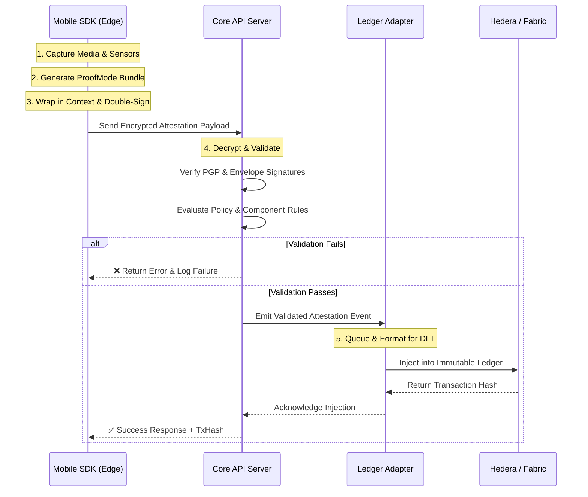

# Architectural Design

---

This document outlines the high-level architecture, system flow, and component boundaries for the Vusense Verification-as-a-Service (VaaS) platform.

## 1. High-Level System Flow

The Vusense lifecycle guarantees end-to-end provenance of media by executing validation at multiple boundaries (Edge, Core, and Ledger).

## 2. Component Boundaries & Technical Specifications

While our repository structure defines *where* the code lives, this section defines the *internal architecture* and technical responsibilities of each tier.

### A. The Edge (Mobile SDK Architecture)

The mobile SDK operates in a fundamentally hostile, zero-trust environment. Its architecture must prioritize tamper-resistance and local efficiency.

* **Secure Capture Buffer:** Media must be captured directly to volatile memory (RAM) or secure app-sandbox storage. Writing raw media to the public camera roll before hashing allows for "swap" attacks.
* **Hardware-Backed Cryptography:** Keys used for the `vusense_envelope_signature` must be generated and stored inside the iOS Secure Enclave or Android Hardware-Backed Keystore, ensuring the private key can never be exported.
* **The "First-Pass" Engine:** Before consuming mobile bandwidth, the SDK runs a local ruleset:
  * *Integrity Checks:* Is the device jailbroken/rooted? (e.g., iOS App Attest / Android Play Integrity API).
  * *Sensor Quality bounds:* Does the GPS have high enough accuracy? Is the timestamp synced with a trusted NTP server?

### B. The Core (Server-Side Architecture)

The Core Server is the source of truth for business logic. It should be architected as a stateless, horizontally scalable microservice.

* **Ingress & Decryption:** Terminates TLS, handles API rate-limiting, and decrypts the incoming payload using the Server's private key.
* **The "Second-Pass" Rules Engine:**
  1. *Mathematical Verification:* Verifies the ProofMode PGP signature and the Vusense Envelope signature.
  2. *Stateful Verification:* Queries the database to ensure the `device_id` hasn't been revoked, the `user_id` is active, and the `policy_id` matches the expected capture rules.
* **Event-Driven Handoff:** To ensure fast API response times to the mobile client, the Core Server should *not* wait for blockchain consensus. Once an attestation is deemed valid, the Core Server publishes a "Valid Attestation Event" to a message broker (e.g., Kafka, RabbitMQ, or Redis PubSub) and returns a `202 Accepted` to the client.

### C. The Ledger (Adapter & Chain Architecture)

By decoupling the ledger integration, the Core Server remains chain-agnostic.

* **The Adapter Pattern (Workers):** The `ledger-adapter-hedera` or `ledger-adapter-fabric` services subscribe to the message broker. They pull "Valid Attestation Events" off the queue and format them into specific blockchain transaction structures.
* **Idempotency & Retries:** Blockchains can experience congestion or downtime. The Adapters are responsible for retry logic, exponential backoffs, and ensuring a single attestation isn't minted twice (idempotency).
* **On-Chain State (Chaincode/Contracts):** The smart contracts maintain a minimal state footprint to save costs. They primarily act as an append-only registry mapping the `sha256_hash` of the media to the finalized `AttestationSignature` JSON, allowing third parties to mathematically verify provenance without needing access to the Vusense Core database.

## 3. Data Provenance & Trust Model

Vusense relies on a **Dual-Structure Envelope** (defined in `attestation_schema.json`) to guarantee trust:

1. **The ProofMode Bundle:** Contains the raw media hash and sensor taxonomy. It is signed locally (often via PGP) proving the *state of the physical device* at capture time.
2. **The Vusense Context:** Wraps the ProofMode bundle with business logic (Policy ID, User ID, Device ID).
3. **The Final Signature:** The entire envelope is signed again by the Vusense SDK. This proves that a valid ProofMode bundle wasn't intercepted and submitted under a different user's identity.
