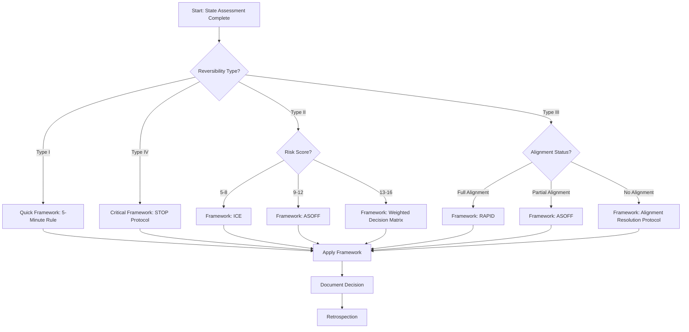

# 4. Framework Selection Logic

## Overview

Framework selection is a critical decision itself. This document provides the logic and tools to select the appropriate framework based on the state assessment from Phase 1.

**Key Principle:** Use the right tool for the job. Framework selection is systematic, not ad-hoc.

## Framework Decision Tree

## Framework Descriptions

### Framework A: STOP Protocol

**Full Name:** Strategic Time-Out for Operational Planning

**Best For:**
- Type IV decisions (critical, irreversible)
- High-stakes strategic pivots
- Values-based disagreements
- Existential decisions

**Time Investment:** 2-5 days

**Process:**
1. **S** - Stop immediately. No decision for 24-48 hours
2. **T** - Think independently. Each cofounder documents their position privately
3. **O** - Observe data. Gather objective metrics, customer feedback, market data
4. **P** - Proceed collaboratively. Re-convene with documented positions and data

**Documentation:** Required (see [`./templates/stop-protocol.md`](./templates/stop-protocol.md))

**Retrospection:** Mandatory

**When to Use:**
- Raising capital
- Major product pivot
- Merger/acquisition
- Co-founder departure
- Legal/ethical crises

**When NOT to Use:**
- Time-critical decisions (use Emergency Protocol)
- Low-stakes operational decisions (use RAPID or 5-Minute Rule)
- Tactical decisions (use ICE or ASOFF)

---

### Framework B: ASOFF

**Full Name:** Assess, Stake, Options, Filter, Finalize

**Best For:**
- Type II/III decisions
- Medium-high risk scenarios
- Partial alignment between cofounders
- Decisions with multiple viable options

**Time Investment:** 1-3 days

**Process:**
1. **A** - Assess the situation comprehensively
2. **S** - Stake positions with written rationales
3. **O** - Options generation (minimum 3 alternatives)
4. **F** - Filter options against criteria
5. **F** - Finalize with mutual agreement

**Documentation:** Required (see [`./templates/asoff-worksheet.md`](./templates/asoff-worksheet.md))

**Retrospection:** Recommended

**When to Use:**
- Hiring decisions (non-executive)
- Vendor selection
- Feature prioritization
- Marketing strategy decisions
- Partnership agreements

**When NOT to Use:**
- Time-critical emergencies (use Emergency Protocol)
- Simple binary decisions (use ICE)
- Full alignment scenarios (use RAPID)

---

### Framework C: ICE

**Full Name:** Impact, Confidence, Ease

**Best For:**
- Type II decisions
- Medium-low risk scenarios
- Tactical decisions
- Quick prioritization among options

**Time Investment:** 1-2 hours

**Process:**
1. **I** - Impact: What's the potential outcome? (Scale 1-10)
2. **C** - Confidence: How certain are we? (Scale 1-10)
3. **E** - Ease: How difficult to implement? (Scale 1-10)
4. Calculate: ICE Score = Impact × Confidence × Ease
5. Select option with highest ICE Score

**Documentation:** Required (see [`./templates/ice-scorecard.md`](./templates/ice-scorecard.md))

**Retrospection:** Optional

**When to Use:**
- Feature prioritization
- Marketing channel selection
- Quick A/B test decisions
- Small investments (<$10K)
- Process improvements

**When NOT to Use:**
- High-stakes strategic decisions (use STOP)
- Values-based disagreements (use STOP or Alignment Resolution)
- Complex multi-criteria decisions (use Weighted Matrix)

---

### Framework D: RAPID

**Full Name:** Recommend, Agree, Perform, Input, Decide

**Best For:**
- Type III decisions with full alignment
- Operational decisions
- Time-sensitive but not critical decisions
- Decisions with clear domain expertise

**Time Investment:** 2-4 hours

**Process:**
1. **R** - Recommend: One cofounder recommends
2. **A** - Agree: Other cofounder agrees or objects
3. **P** - Perform: If agreed, execute
4. **I** - Input: If disagreement, provide input only
5. **D** - Decide: Final decision by designated role

**Documentation:** Required (see [`./templates/rapid-log.md`](./templates/rapid-log.md))

**Retrospection:** Optional

**When to Use:**
- Day-to-day operational decisions
- Domain-expert decisions (e.g., technical architecture by CTO)
- Time-sensitive decisions
- Low-risk but important decisions

**When NOT to Use:**
- High-stakes strategic decisions (use STOP)
- Values-based disagreements (use STOP)
- No clear domain expertise (use ASOFF or Weighted Matrix)

---

### Framework E: 5-Minute Rule

**Best For:**
- Type I decisions (easily reversible)
- Low risk scenarios
- Quick tactical decisions
- Decisions with minimal impact

**Time Investment:** 5 minutes

**Process:**
1. Each cofounder states their position (2 minutes each)
2. Quick alignment check (1 minute)
3. If aligned: proceed immediately
4. If not aligned: escalate to ICE framework

**Documentation:** Minimal (see [`./templates/5-minute-log.md`](./templates/5-minute-log.md))

**Retrospection:** None

**When to Use:**
- Software library changes
- Small tool purchases
- Minor process tweaks
- Low-cost experiments
- Routine operational decisions

**When NOT to Use:**
- Any decision with >$10K impact (use ICE or ASOFF)
- Any decision with >1 week timeline impact (use ICE)
- Any decision requiring contracts or commitments (use ASOFF)

---

### Framework F: Weighted Decision Matrix

**Best For:**
- Type III decisions
- High complexity scenarios
- Multiple criteria decisions
- Decisions requiring quantitative comparison

**Time Investment:** 4-8 hours

**Process:**
1. Identify decision criteria (5-7 max)
2. Weight criteria by importance (sum = 100%)
3. Generate options (3-5 max)
4. Score each option against each criterion (1-10)
5. Calculate weighted scores
6. Select highest-scoring option

**Documentation:** Required (see [`./templates/weighted-decision-matrix.md`](./templates/weighted-decision-matrix.md))

**Retrospection:** Recommended

**When to Use:**
- Complex vendor selection
- Technology stack decisions
- Geographic expansion decisions
- Product roadmap prioritization
- Strategic partnership evaluation

**When NOT to Use:**
- Simple binary decisions (use ICE)
- Time-critical decisions (use RAPID or Emergency Protocol)
- Values-based disagreements (use STOP)

---

### Framework G: Alignment Resolution Protocol

**Best For:**
- Any decision where alignment cannot be achieved on problem statement
- Values-based disagreements
- Fundamental strategic disagreements

**Time Investment:** 1-3 days

**Process:**
1. Separate problem statement from solution
2. Each cofounder writes their understanding of the problem
3. Compare and identify discrepancies
4. Gather external data to resolve discrepancies
5. Re-establish problem statement alignment
6. Proceed with appropriate decision framework

**Documentation:** Required (see [`./templates/alignment-resolution-log.md`](./templates/alignment-resolution-log.md))

**Retrospection:** Mandatory

**When to Use:**
- Disagreement on problem statement
- Values-based conflicts
- Strategic direction disagreements
- When cofounders are "talking past each other"

**When NOT to Use:**
- Tactical disagreements on solutions (use ASOFF)
- Full alignment scenarios (use appropriate framework)

---

## Framework Selection Matrix

| Decision Context | Recommended Framework | Alternative |
|------------------|----------------------|-------------|
| Type I, Low Risk | 5-Minute Rule | ICE |
| Type II, Low-Med Risk | ICE | ASOFF |
| Type II, Med-High Risk | ASOFF | Weighted Matrix |
| Type III, Full Alignment | RAPID | Weighted Matrix |
| Type III, Partial Alignment | ASOFF | STOP |
| Type III, No Alignment | Alignment Resolution | STOP |
| Type IV, Any Risk | STOP | Weighted Matrix |
| High Complexity | Weighted Matrix | ASOFF |
| Time-Critical | RAPID | 5-Minute Rule |
| Values-Based | STOP | Alignment Resolution |
| Domain Expertise Clear | RAPID | ASOFF |
| Multiple Options | ASOFF | Weighted Matrix |
| Binary Decision | ICE | 5-Minute Rule |

## Framework Comparison

| Framework | Time | Complexity | Best Alignment | Best Risk | Documentation |
|-----------|------|------------|----------------|-----------|---------------|
| 5-Minute Rule | 5 min | Low | Full | Low | Minimal |
| ICE | 1-2 hrs | Low | Full/Partial | Low-Med | Required |
| RAPID | 2-4 hrs | Low | Full | Low-Med | Required |
| ASOFF | 1-3 days | Medium | Partial | Med-High | Required |
| Weighted Matrix | 4-8 hrs | High | Full/Partial | Med-High | Required |
| STOP | 2-5 days | High | Any | Critical | Required |
| Alignment Resolution | 1-3 days | Medium | None | Any | Required |

## Selection Best Practices

### Practice 1: Trust the Process

If the decision tree points to a framework, use it. Don't framework-shop.

**Why:**
- Framework selection is itself a decision
- Second-guessing leads to analysis paralysis
- The framework is designed based on experience

### Practice 2: Consider Time Constraints

If time is critical but the decision tree suggests a longer framework, consider:

1. Is the time constraint real or perceived?
2. Can we use Emergency Protocol?
3. Can we simplify the framework while maintaining rigor?

### Practice 3: Document Framework Selection

Record why you selected a particular framework in the Decision Context Card.

**Why:**
- Enables retrospection on framework selection
- Provides audit trail
- Supports learning

### Practice 4: Be Willing to Escalate

If the selected framework isn't working, don't force it. Escalate.

**Why:**
- Frameworks are tools, not straitjackets
- Escalation is a built-in feature
- Better to escalate than to make a bad decision

## Common Selection Mistakes

### Mistake 1: Over-Engineering

**Symptom:** Using STOP for a $5K decision.

**Solution:** Trust the reversibility assessment. Type I decisions should use lightweight frameworks.

### Mistake 2: Under-Engineering

**Symptom:** Using 5-Minute Rule for a $500K pivot.

**Solution:** Trust the risk assessment. High-risk decisions deserve thorough frameworks.

### Mistake 3: Ignoring Alignment

**Symptom:** Using ASOFF when cofounders disagree on the problem statement.

**Solution:** Always check alignment first. Use Alignment Resolution Protocol when needed.

### Mistake 4: Framework Shopping

**Symptom:** Trying different frameworks until getting the desired outcome.

**Solution:** Framework selection happens before knowing the outcome. Stick with the selection.

## Framework Selection Examples

### Example 1: Type I, Low Risk

**Decision:** Switch project management tool

**State Assessment:**
- Reversibility: Type I (can switch back in 1 week)
- Risk: Score 6 (Low)
- Alignment: Full

**Framework Selection:**
- Decision tree: Type I → 5-Minute Rule
- Alternative: ICE (if cofounders want more rigor)

**Result:** 5-Minute Rule is appropriate

### Example 2: Type II, Medium Risk, Partial Alignment

**Decision:** Hire first salesperson

**State Assessment:**
- Reversibility: Type II (employment contract)
- Risk: Score 11 (Medium)
- Alignment: Partial (disagree on profile)

**Framework Selection:**
- Decision tree: Type II, Risk 9-12 → ASOFF
- Alternative: Weighted Matrix (for more rigor)

**Result:** ASOFF is appropriate

### Example 3: Type IV, Critical Risk

**Decision:** Raise Series A

**State Assessment:**
- Reversibility: Type IV (impossible to reverse)
- Risk: Score 18 (Critical)
- Alignment: Full

**Framework Selection:**
- Decision tree: Type IV → STOP Protocol
- Alternative: None (STOP is mandatory for Type IV)

**Result:** STOP Protocol is required

## Next Steps

After framework selection:

1. **Apply the framework** using the appropriate template (see [05-framework-application.md](./05-framework-application.md))
2. **Document the decision** in the Decision Register
3. **Complete retrospection** if required (see [07-retrospection.md](./07-retrospection.md))

---

**Next: [05-framework-application.md](./05-framework-application.md)**
