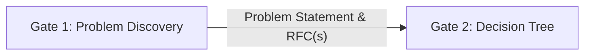

# Vusense Command Center

Structured, auditable processes for the executive team at Vusense. 
This repository is the system of record (Markdown + Git, Obsidian-friendly).
Keep it *process document only* - no filled templates! 

## Start here

| If you are… | Read |
| ----------- | ---- |
| New to the process | [Gate 1 executive summary](./decision-framework/01-problem-discovery/01-executive-summary.md), then this doc [Operating model](#operating-model) |
| Logging or prioritizing a problem | [03-problem-discovery.md](./decision-framework/01-problem-discovery/03-problem-discovery.md) |
| Ready to decide (have Problem Statement + RFC) | [03-state-gathering.md](./decision-framework/02-decision-tree/03-state-gathering.md) |
| Need a cheat sheet | [11-quick-reference.md](./decision-framework/02-decision-tree/11-quick-reference.md) |
| Technical / architecture decision | [00-decision-integration.md](./technical-stack/00-decision-integration.md) |
| Framework deep dive | [Gate 1 README](./decision-framework/01-problem-discovery/README.md) · [Gate 2 README](./decision-framework/02-decision-tree/README.md) · [Technical stack](./technical-stack/00-decision-integration.md) |

## Two gates

1. **[Gate 1 — Problem Discovery](./decision-framework/01-problem-discovery/README.md)** — EB-25 prioritization, problem identification, RFCs
2. **[Gate 2 — Decision Tree](./decision-framework/02-decision-tree/README.md)** — state assessment, framework selection (STOP, ASOFF, ICE, …), decision register, retrospection

**Do not skip Gate 1** except under [expedited or emergency rules](./decision-framework/01-problem-discovery/07-emergency-and-expedited.md).

## Repository map

| Path | Purpose |
| ---- | ------- |
| [decision-framework/01-problem-discovery/](./decision-framework/01-problem-discovery/README.md) | Gate 1 framework (7 docs + templates) |
| [decision-framework/02-decision-tree/](./decision-framework/02-decision-tree/README.md) | Gate 2 meta-framework (11 docs + templates) |
| [technical-stack/](./technical-stack/00-decision-integration.md) | Product and architecture context |

## Operating model

How Vusense uses this framework in practice (v1.0). Framework docs remain authoritative for methodology; this section records adoption and operations.

### Direction

| Thread | Decision | Rationale |
| ------ | -------- | --------- |
| **Adoption** | **Mandatory two-gate flow** for all executive decisions (cofounder sign-off). Defined exceptions only (see below). | Preserves audit trail and problem-first discipline. |
| **Operationalize** | **Markdown + Git in this repo** is the system of record for **process documentation only**. Do not commit filled-in templates here. | Keeps the repo a clean framework reference; live work stays elsewhere. |
| **Harden docs** | Gap fixes in framework docs + this index (emergency path, RFC options rule, Technical Stack bridge). | Reduces ambiguity before first live decision. |
| **Technical stack bridge** | Platform/architecture decisions **must** enter via Gate 1 when they meet executive-decision criteria ([`technical-stack/00-decision-integration.md`](./technical-stack/00-decision-integration.md)). | Keeps product context and decision process linked. |
| **Tooling** | **Phase 2** — no custom app in v1.0. Optional: Obsidian Dataview, git hooks, or Linear labels later. | Process proof before automation. |

### Who must use the gates

| Role | Gate 1 (Problem Discovery) | Gate 2 (Decision Tree) |
| ---- | -------------------------- | ------------------------ |
| Cofounders / executives | Required for sign-off decisions | Required |
| CTO (technical exec decisions) | Required when decision meets criteria in [technical stack integration](./technical-stack/00-decision-integration.md) | Required |
| Engineering leads | May draft RFCs and problem captures; do not bypass finalized handoff | N/A without exec sign-off |
| Board / advisors | Input via RFC review or escalation; not day-to-day backlog owners | Escalation path only |

**Board visibility:** Export completed [Decision Register](./decision-framework/02-decision-tree/templates/decision-register.md) rows into quarterly board packs (see [08-documentation-due-diligence.md](./decision-framework/02-decision-tree/08-documentation-due-diligence.md)).

### Exceptions (bypass or compress Gate 1)

Full criteria: [07-emergency-and-expedited.md](./decision-framework/01-problem-discovery/07-emergency-and-expedited.md).

| Situation | Gate 1 | Gate 2 |
| --------- | ------ | ------ |
| Standard executive decision | Full EB-25 → Problem Statement → RFC | Full meta-framework |
| **Expedited** (urgent, important, &lt;48h) | Compressed identification + single RFC with ≥3 options | Full or Emergency per risk |
| **Emergency** (&lt;4h harm if delayed) | Retroactive Problem Statement within 24h | Emergency Protocol; retroactive RFC within 48h if missing |

Bypass without retroactive documentation is **not permitted** for investor-facing or Type III/IV decisions.

### Operating rhythm

| Cadence | Activity | Owner |
| ------- | -------- | ----- |
| **Continuous** | Symptom capture to EB-25 raw backlog | Anyone |
| **Weekly** | EB-25 hygiene: promote/demote Top 5, enforce 25-item cap | CTO or designated exec |
| **Per Top-5 item** | Problem Identification + RFC lifecycle | Problem owner (exec sponsor) |
| **On handoff** | State Gathering within 5 business days | Cofounders |
| **Quarterly** | Framework review + success metrics check | Executive team |

### Working copies (outside this repo)

Templates under `decision-framework/01-problem-discovery/templates/` and `decision-framework/02-decision-tree/templates/` are **blank masters**. For each live decision:

1. Copy the relevant template(s) to your team workspace (Obsidian vault, shared drive, or ticket system).
2. Use ID convention **`YYYY-MM-DD-short-slug`** (e.g. `2026-05-21-sdk-platform`) in filenames and register rows.
3. Never edit the master templates in this repository in place.

### Framework health metrics (lightweight v1.0)

Review quarterly (spreadsheet, board deck, or separate ops notes):

- EB-25 backlog count (target ≤25)
- Top 5 items with finalized RFCs ready for handoff
- Decisions completed in register vs bypassed without documentation
- Retrospection completion rate for mandatory frameworks
- Average days from RFC finalize to Decision Register entry

### Tooling (Phase 2)

- **[Decision app](./decision-app/README.md)** — Dockerized Streamlit UI for Gate 1 + Gate 2 (working copies in `decision-app/data/`, not in this repo)
- Obsidian Dataview or similar over exported Markdown from the app
- PR-based RFC review for engineering-heavy RFCs
- Optional integration: RFC structure aligns with ADR-style records

## Document control

| Version | Date | Classification |
| ------- | ---- | -------------- |
| 1.0 | 2026-05-21 | Internal — Board & Executive |

Framework doc versions remain in each gate’s executive summary (authoritative for framework text).

---

**Maintained by:** Vusense Executive Team | **Review:** Quarterly
