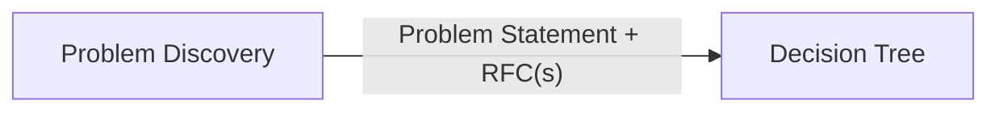

# Vusense Command Center

Structured, auditable process for **executive technical and strategic decisions** at Vusense. This repository is the system of record (Markdown + Git, Obsidian-friendly).

## Start here

| If you are… | Read |
| ----------- | ---- |
| New to the process | [OPERATING-MODEL.md](./OPERATING-MODEL.md) then [Problem Discovery/01-executive-summary.md](./Problem%20Discovery/01-executive-summary.md) |
| Logging or prioritizing a problem | [Problem Discovery/03-problem-discovery.md](./Problem%20Discovery/03-problem-discovery.md) |
| Ready to decide (have Problem Statement + RFC) | [Decision Tree/03-state-gathering.md](./Decision%20Tree/03-state-gathering.md) |
| Need a cheat sheet | [Decision Tree/11-quick-reference.md](./Decision%20Tree/11-quick-reference.md) |
| Technical / architecture decision | [Technical Stack/00-decision-integration.md](./Technical%20Stack/00-decision-integration.md) |
| Learning by example | [examples/exemplar-sdk-platform.md](./examples/exemplar-sdk-platform.md) |

## Two gates

1. **[Problem Discovery](./Problem%20Discovery/)** — EB-25 prioritization, problem identification, RFCs  
2. **[Decision Tree](./Decision%20Tree/)** — state assessment, framework selection (STOP, ASOFF, ICE, …), decision register, retrospection  

**Do not skip Gate 1** except under [expedited or emergency rules](./Problem%20Discovery/07-emergency-and-expedited.md). See [OPERATING-MODEL.md](./OPERATING-MODEL.md) for adoption, rhythm, and where artifacts live.

## Repository map

| Path | Purpose |
| ---- | ------- |
| [Problem Discovery/](./Problem%20Discovery/) | Gate 1 framework (6 docs + templates) |
| [Decision Tree/](./Decision%20Tree/) | Gate 2 meta-framework (11 docs + templates) |
| [Technical Stack/](./Technical%20Stack/) | Product and architecture context |
| [decisions/](./decisions/) | Live decision artifacts (backlog, RFCs, register) |
| [examples/](./examples/) | Worked examples through both gates |
| [OPERATING-MODEL.md](./OPERATING-MODEL.md) | How we run the process day to day |
| [Decision Tree.md](./Decision%20Tree.md) | Short redirect to Decision Tree folder |

## Live decisions

Copy templates into [`decisions/`](./decisions/) using IDs like `YYYY-MM-DD-short-slug`. See OPERATING-MODEL for folder layout.

## Document control

| Version | Date | Classification |
| ------- | ---- | -------------- |
| 1.0 | 2026-05-21 | Internal — Board & Executive |

Framework doc versions remain in each folder’s executive summary (authoritative for framework text).

---

**Maintained by:** Vusense Executive Team | **Review:** Quarterly
