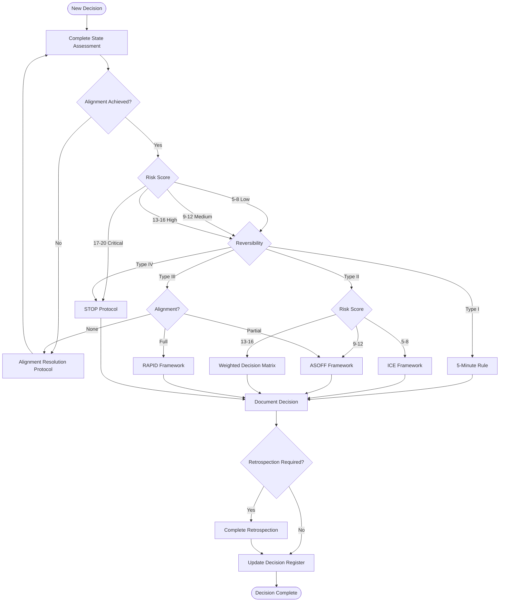

# 11. Quick Reference

## Overview

This document provides quick reference materials for the decision meta-framework, including cheat sheets, flowcharts, and a glossary.

**Purpose:** Rapid lookup during active decision-making.

## Framework Selection Cheat Sheet

### Decision Type → Framework

| Decision Context            | Recommended Framework | Alternative          |
| --------------------------- | --------------------- | -------------------- |
| Type I, Low Risk            | 5-Minute Rule         | ICE                  |
| Type II, Low-Med Risk       | ICE                   | ASOFF                |
| Type II, Med-High Risk      | ASOFF                 | Weighted Matrix      |
| Type III, Full Alignment    | RAPID                 | Weighted Matrix      |
| Type III, Partial Alignment | ASOFF                 | STOP                 |
| Type III, No Alignment      | Alignment Resolution  | STOP                 |
| Type IV, Any Risk           | STOP                  | Weighted Matrix      |
| High Complexity             | Weighted Matrix       | ASOFF                |
| Time-Critical               | RAPID                 | 5-Minute Rule        |
| Values-Based                | STOP                  | Alignment Resolution |
| Domain Expertise Clear      | RAPID                 | ASOFF                |
| Multiple Options            | ASOFF                 | Weighted Matrix      |
| Binary Decision             | ICE                   | 5-Minute Rule        |

## Problem Discovery (Priority Filter)

### What is Problem Discovery?

The **Problem Discovery Framework** precedes the Decision Tree and ensures we never make excellent decisions on the wrong problems. It uses the **EB-25 (Eisenhower-Buffett 25)** methodology to prioritize problems before they enter the decision-making process.

**The EB-25 Methodology:**

- **Eisenhower Matrix:** Filter problems by urgency and importance
- **Buffett's 5/25 Rule:** Strictly limit to 25 active problems (Top 5 + Next 20)

### Integration with State Assessment

All decisions entering the Decision Tree should have a formal **Problem Statement** developed through the Problem Discovery framework:

```
Problem Discovery (EB-25) → Problem Identification → RFC → Decision Tree State Assessment
```

**Application:**

| Problem Discovery Status                               | Action                          | Proceed to Decision Tree? |
| ---------------------------------------------------- | ------------------------------- | ------------------------- |
| Problem in Top 5 + Problem Statement + Finalized RFC | Proceed to State Assessment     | YES                       |
| Problem in Next 20                                   | Wait for promotion to Top 5     | NO                        |
| No Problem Statement                                 | Go to Problem Discovery framework | NO                        |
| No RFC                                               | Draft and finalize RFC          | NO                        |
| RFC with fewer than 3 options                        | Add options per handoff rule    | NO                        |

**Benefits:**

- Prevents solution-first thinking
- Ensures executive time is spent on high-impact problems
- Provides structured solution options (RFCs) for evaluation
- Streamlines the decision-making process

**Options rule:** ≥3 options in one finalized RFC or across multiple RFCs. See `../01-problem-discovery/06-handoff-to-decision.md`.

**Emergency:** See `../01-problem-discovery/07-emergency-and-expedited.md` and Emergency Protocol in [06-special-protocols.md](./06-special-protocols.md).

**Reference:**

See `../01-problem-discovery/` for the complete Problem Discovery Framework documentation.

## Time Investments

| Framework            | Time Investment                        | Retrospection |
| -------------------- | -------------------------------------- | ------------- |
| 5-Minute Rule        | 5 minutes                              | None          |
| ICE                  | 1-2 hours                              | Optional      |
| RAPID                | 2-4 hours                              | Optional      |
| ASOFF                | 1-3 days                               | Recommended   |
| Weighted Matrix      | 4-8 hours                              | Recommended   |
| STOP                 | 2-5 days                               | Mandatory     |
| Alignment Resolution | 1-3 days                               | Mandatory     |
| Emergency            | <1 hour decision, 24-48h documentation | Mandatory     |

## Documentation Requirements

| Framework            | Documentation | Sign-off | Decision Register |
| -------------------- | ------------- | -------- | ----------------- |
| 5-Minute Rule        | Minimal       | Required | Required          |
| ICE                  | Required      | Required | Required          |
| RAPID                | Required      | Required | Required          |
| ASOFF                | Required      | Required | Required          |
| Weighted Matrix      | Required      | Required | Required          |
| STOP                 | Required      | Required | Required          |
| Alignment Resolution | Required      | Required | Required          |
| Emergency            | Required      | Required | Required          |

## Risk Assessment Quick Reference

### Risk Categories

| Risk Category      | Low (1)                               | Medium (2)  | High (3)    | Critical (4) |
| ------------------ | ------------------------------------- | ----------- | ----------- | ------------ |
| Financial impact   | <$10K | $10K-$100K | $100K-$1M | >$1M |             |             |              |
| Timeline impact    | <1 week                               | 1-4 weeks   | 1-3 months  | >3 months    |
| Team morale impact | Minimal                               | Noticeable  | Significant | Severe       |
| Customer impact    | None                                  | Minor       | Moderate    | Major        |
| Strategic impact   | Tactical                              | Operational | Strategic   | Existential  |

### Risk Score Calculation

```
Risk Score = Financial + Timeline + Team + Customer + Strategic
```

**Risk Categories:**

- **Score 5-8:** Low-risk decision
- **Score 9-12:** Medium-risk decision
- **Score 13-16:** High-risk decision
- **Score 17-20:** Critical-risk decision

## Reversibility Quick Reference

### Reversibility Types

| Type     | Description                  | Cost       | Time       |
| -------- | ---------------------------- | ---------- | ---------- |
| Type I   | Easily reversible            | <$10K      | <1 week    |
| Type II  | Moderately reversible        | $10K-$100K | 1-4 weeks  |
| Type III | Difficult to reverse         | $100K-$1M  | 1-3 months |
| Type IV  | Nearly impossible to reverse | >$1M       | >3 months  |

## Framework Selection Flowchart



## Meta-Framework Process Flow

```
┌─────────────────────────────────────────────────────────────┐
│                    PHASE 1: STATE GATHERING                  │
│  ┌─────────────┐  ┌─────────────┐  ┌─────────────────────┐  │
│  │ Alignment   │  │    Risk     │  │   Reversibility     │  │
│  │   Check     │  │ Assessment  │  │     Assessment      │  │
│  └─────────────┘  └─────────────┘  └─────────────────────┘  │
│                           │                                  │
│                           ▼                                  │
│                  Decision Context Card                       │
└─────────────────────────────────────────────────────────────┘
                           │
                           ▼
┌─────────────────────────────────────────────────────────────┐
│                   PHASE 2: FRAMEWORK SELECTION               │
│  ┌─────────────┐  ┌─────────────┐  ┌─────────────────────┐  │
│  │   Decision  │  │  Selection  │  │  Framework          │  │
│  │    Tree     │  │   Matrix    │  │   Chosen            │  │
│  └─────────────┘  └─────────────┘  └─────────────────────┘  │
└─────────────────────────────────────────────────────────────┘
                           │
                           ▼
┌─────────────────────────────────────────────────────────────┐
│                  PHASE 3: FRAMEWORK APPLICATION              │
│  ┌─────────────┐  ┌─────────────┐  ┌─────────────────────┐  │
│  │  Apply      │  │  Document   │  │   Sign-off          │  │
│  │  Framework  │  │  Process    │  │   Required          │  │
│  └─────────────┘  └─────────────┘  └─────────────────────┘  │
└─────────────────────────────────────────────────────────────┘
                           │
                           ▼
┌─────────────────────────────────────────────────────────────┐
│                    PHASE 4: RETROSPECTION                    │
│  ┌─────────────┐  ┌─────────────┐  ┌─────────────────────┐  │
│  │  Assess     │  │  Evaluate   │  │   Improve           │  │
│  │  Outcomes   │  │  Framework  │  │   Process           │  │
│  └─────────────┘  └─────────────┘  └─────────────────────┘  │
└─────────────────────────────────────────────────────────────┘
```

## Template Quick Links

| Template                 | Purpose                | Location                                                                            |
| ------------------------ | ---------------------- | ----------------------------------------------------------------------------------- |
| Decision Context Card    | State assessment       | [`./templates/decision-context-card.md`](./templates/decision-context-card.md)       |
| STOP Protocol            | STOP framework         | [`./templates/stop-protocol.md`](./templates/stop-protocol.md)                       |
| ASOFF Worksheet          | ASOFF framework        | [`./templates/asoff-worksheet.md`](./templates/asoff-worksheet.md)                   |
| ICE Scorecard            | ICE framework          | [`./templates/ice-scorecard.md`](./templates/ice-scorecard.md)                       |
| RAPID Log                | RAPID framework        | [`./templates/rapid-log.md`](./templates/rapid-log.md)                               |
| Weighted Decision Matrix | Weighted matrix        | [`./templates/weighted-decision-matrix.md`](./templates/weighted-decision-matrix.md) |
| Alignment Resolution Log | Alignment protocol     | [`./templates/alignment-resolution-log.md`](./templates/alignment-resolution-log.md) |
| Retrospection Template   | Decision retrospection | [`./templates/retrospection-template.md`](./templates/retrospection-template.md)     |
| Decision Register        | Master decision record | [`./templates/decision-register.md`](./templates/decision-register.md)               |

## Escalation Quick Reference

### Escalation Triggers

- Framework application exceeds time investment by 2x
- Cofounders cannot reach agreement after framework completion
- Decision is time-critical and framework is too slow
- One cofounder believes the wrong framework was selected

### Escalation Path

1. **Level 1:** Mutual agreement to try alternative framework
2. **Level 2:** Advisory board input (if available)
3. **Level 3:** Board of Directors decision (if constituted)
4. **Level 4:** External mediator/consultant

## Emergency Protocol Quick Reference

### Emergency Conditions

- Decision must be made within 4 hours
- Delay causes significant harm
- No time for full framework application

### Emergency Process

1. Quick state assessment (15 minutes)
2. Use 5-Minute Rule or RAPID
3. Make decision immediately
4. Document decision immediately
5. Complete full documentation within 24 hours
6. Complete retrospection within 48 hours

## Glossary

### A

**Alignment:** Shared understanding of problem statement and success metrics between cofounders.

**Alignment Resolution Protocol:** Special protocol for resolving disagreements on problem statement before framework application.

**ASOFF:** Assess, Stake, Options, Filter, Finalize - a framework for medium-high risk decisions with partial alignment.

### C

**Cofounder:** Executive team member with decision-making authority.

**Critical Risk:** Risk score of 17-20, indicating existential threat to the company.

### D

**Decision Context Card:** Template for capturing state assessment (alignment, risk, reversibility).

**Decision Register:** Master record of all executive decisions.

**Documentation:** Required records of framework application, outcomes, and retrospection.

### E

**Emergency Protocol:** Special protocol for time-critical decisions requiring immediate action.

**Escalation:** Process for seeking external input or decision authority when frameworks fail.

### F

**Framework:** Structured methodology for making decisions.

**Framework Application:** Phase 3 of meta-framework, applying selected framework to make decision.

**Framework Selection:** Phase 2 of meta-framework, choosing appropriate framework based on state assessment.

### H

**High Risk:** Risk score of 13-16, indicating significant impact across multiple domains.

### I

**ICE:** Impact, Confidence, Ease - a framework for low-medium risk tactical decisions.

### L

**Low Risk:** Risk score of 5-8, indicating minimal impact across all domains.

### M

**Medium Risk:** Risk score of 9-12, indicating noticeable impact across one or more domains.

**Meta-Framework:** Process for selecting and applying appropriate decision frameworks.

### O

**One-Way Door:** Decision that is difficult or impossible to reverse.

### P

**Partial Alignment:** Agreement on problem but not on approach or success metrics.

### R

**RAPID:** Recommend, Agree, Perform, Input, Decide - a framework for operational decisions with full alignment.

**Retrospection:** Phase 4 of meta-framework, assessing decision outcomes and framework effectiveness.

**Reversibility:** Ability to undo a decision and return to previous state.

**Risk Assessment:** Evaluation of potential impact across financial, timeline, team, customer, and strategic domains.

**Risk Score:** Calculated assessment (5-20) of decision impact across five domains.

### S

**State Assessment:** Phase 1 of meta-framework, evaluating alignment, risk, and reversibility.

**STOP:** Strategic Time-Out for Operational Planning - a framework for critical, irreversible decisions.

### T

**Two-Way Door:** Decision that is easily reversible with minimal cost.

### V

**Values-Based Disagreement:** Disagreement on fundamental priorities or vision, not tactical approach.

## Common Decision Scenarios

### Scenario 1: Hiring Decision

**Context:** Hiring first senior engineer

**State Assessment:**

- Alignment: Full
- Risk: Medium (Score 11)
- Reversibility: Type II

**Framework:** ASOFF

**Time Investment:** 1-3 days

**Documentation:** ASOFF Worksheet

### Scenario 2: Technology Stack Change

**Context:** Switching from AWS to GCP for non-critical service

**State Assessment:**

- Alignment: Full
- Risk: Low (Score 6)
- Reversibility: Type I

**Framework:** 5-Minute Rule or ICE

**Time Investment:** 5 minutes to 2 hours

**Documentation:** 5-Minute Log or ICE Scorecard

### Scenario 3: Strategic Pivot

**Context:** Pivoting from B2C to B2B focus

**State Assessment:**

- Alignment: Full
- Risk: Critical (Score 18)
- Reversibility: Type IV

**Framework:** STOP Protocol

**Time Investment:** 2-5 days

**Documentation:** STOP Protocol

### Scenario 4: Marketing Investment

**Context:** $50K investment in new marketing channel

**State Assessment:**

- Alignment: Partial
- Risk: Medium (Score 10)
- Reversibility: Type II

**Framework:** ASOFF

**Time Investment:** 1-3 days

**Documentation:** ASOFF Worksheet

### Scenario 5: Office Lease

**Context:** Signing 1-year office lease

**State Assessment:**

- Alignment: Full
- Risk: High (Score 14)
- Reversibility: Type III

**Framework:** Weighted Decision Matrix

**Time Investment:** 4-8 hours

**Documentation:** Weighted Decision Matrix

## Contact Information

**Framework Questions:**

- [Cofounder A Email]
- [Cofounder B Email]

**Escalation Contacts:**

- Advisory Board: [Contact]
- Board of Directors: [Contact]
- External Mediator: [Contact]

**Document Maintenance:**

- Owner: Executive Team
- Review Cycle: Quarterly
- Next Review: [DATE]

---

**End of Quick Reference**
