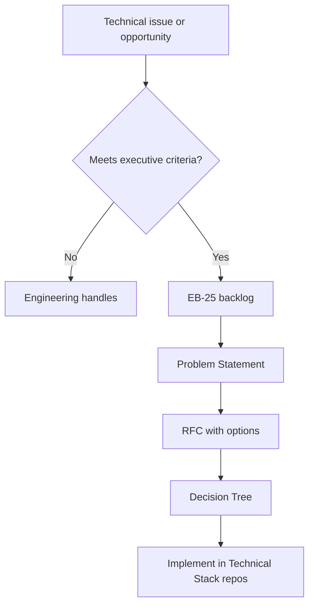

# Technical Stack — Decision Integration

## Purpose

The [technical stack](./) documents **what Vusense is building**. [Gate 1 — Problem Discovery](../decision-framework/01-problem-discovery/) and [Gate 2 — Decision Tree](../decision-framework/02-decision-tree/) document **how executives decide**. This file defines when technical work must enter the two-gate process and how artifacts link together.

## Does this decision require the Command Center?

Use **all** criteria below. If **any** is yes, run Gate 1 then Gate 2.

| Criterion | Example |
| --------- | ------- |
| Requires cofounder / executive sign-off | SDK platform choice, ledger selection, major security model |
| Financial impact &gt;$10K or &gt;1 month timeline | New `core-server` stack, hiring plan tied to architecture |
| Hard to reverse within 30 days (Type II+) | Splitting vs monorepo repos, Hedera vs Fabric primary chain |
| Affects attestation trust model or schema | Changes to [`attestation_schema.json`](./attestation_schema.json) |
| Creates investor/board narrative | Pivot, new product boundary, open-source boundary |

**Does not require** Command Center (engineering discretion):

- Routine bug fixes within existing architecture
- Internal refactors with no schema or trust-model change
- Dependency patch upgrades with no behavioral contract change
- Implementation details already decided (e.g. naming a function)

When unsure, **log to EB-25**; weekly hygiene will promote or delete.

## Classification

| Type | Description | Typical framework (Gate 2) |
| ---- | ----------- | ---------------------------- |
| **T1 — Implementation** | How to build within decided architecture | ICE / 5-Minute (if exec still signs off) |
| **T2 — Architecture** | Components, boundaries, data flow ([02-architecture.md](./02-architecture.md)) | ASOFF / Weighted Matrix |
| **T3 — Platform** | Repo structure, SDK strategy, ledger choice ([01-overview.md](./01-overview.md)) | ASOFF / STOP if Type IV |
| **T4 — Trust / security** | Crypto, Enclave, schema, policy engine | STOP or ASOFF + mandatory retrospection |

Record classification on the Problem Statement template field **Decision class** (add when copying template).

## Workflow

## Linking artifacts

On every technical Problem Statement and RFC:

- **Related docs:** Link to affected Technical Stack files (e.g. `02-architecture.md`, agent specs)
- **Repos impacted:** List `sdk-ios`, `core-server`, etc. from [01-overview.md](./01-overview.md) naming scheme
- **Schema version:** If `attestation_schema.json` changes, note version bump plan

On Decision Register entry:

- **Technical outcome:** Link PRs/repos or architecture doc PR updating Technical Stack

## Expedited technical incidents

Security incident, production outage, or active exploit:

1. Follow [07-emergency-and-expedited.md](../decision-framework/01-problem-discovery/07-emergency-and-expedited.md)
2. Decision Tree Emergency Protocol
3. Update Technical Stack docs **after** decision register entry (within 1 week)

## Navigation

- [README.md](../README.md) — repository hub and [operating model](../README.md#operating-model)
- [Gate 1 — Problem Discovery](../decision-framework/01-problem-discovery/)
- [Gate 2 — Decision Tree](../decision-framework/02-decision-tree/)
